# Spring-microservices

> NOTE!!! THIS REAME IS NOT FINISHED, TOMMOROW (23.12.2023) I WILL FINISH IT!!!

## Content
- Briefly about the project
- Quick overview
- Usage examples
- Technologies used
  - Spring Boot
  - Lombok
  - Spring Data JPA
  - Eureka
  - Spring Cloud Gateway
  - Spring Security with JWT authorization
  - Circuit Breaker
- Tests
  - MockMVC
- Conclusion

## Briefly about the project

This is a simple project that was created with a microservice architecture to learn and master the basic technologies when working with such an architecture. I provided explanation for main concepts that were used to create this project///

## Quick overview

From user perspective, project provides:
- CRUD operations for Military Machines
- CRUD operations for Orders

> CRUD stands for basic operations with entities namely Create, Read, Update and Delete

Let's look at the application scheme:

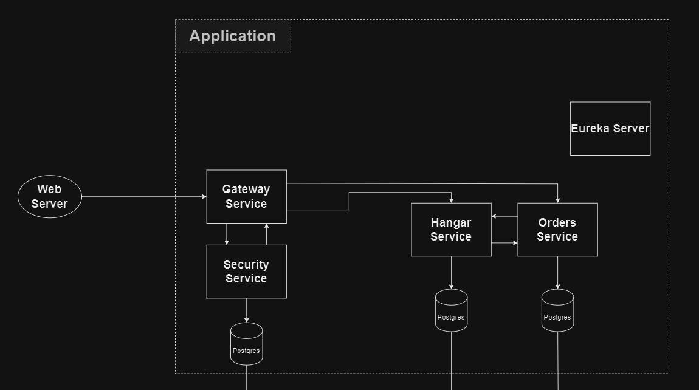

Let's take a closer look at these microservices and the technologies they implement:

- Hangar Service and Orders Service - REST applications
    - Spring Data JPA
    - Eureka Client
      
- Eureka Server - service discovery
    - Eureka Server
      
- Gateway Service - Spring Cloud Gateway
    - Spring Cloud Gateway
      
- Security Service - application guardian
    - Spring Security
    - JWT authorization


## Usage examples

Suppose we want to order several machines. For that, we need some machines to be present in Hangar service. Let's check if we have some. We`ll use /hangar/getAll endpoint:

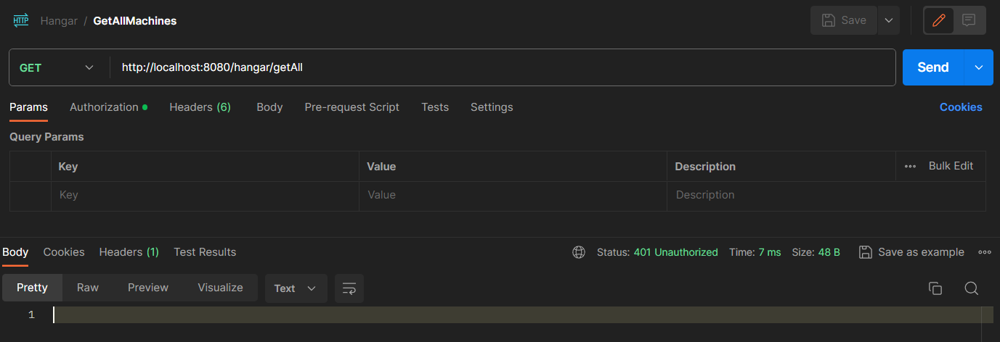

As we can see, we got response UNAUTHORIZED. That means, that we didn't pass the security guard of our application.


To do so, we have to get JWT token first. Let's get it using /security/register endpoint:

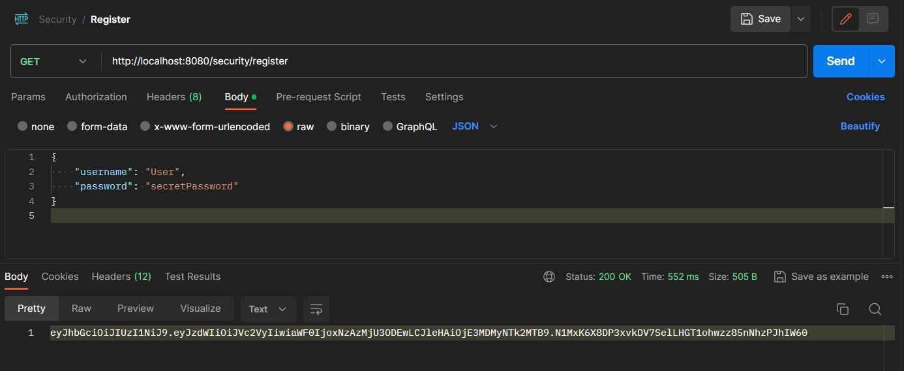


Now we have JWT token to access application!

> Be careful, if you'll look deeper into code you'll see that these tokens have an expiration date. In this project it's set to 1000 * 60 * 30 miliseconds that equals 30 minutes.


Now, let's check if we can see if we have any machines in Hangar:

> To use JWT token, select Authorization tab, then Bearer Token type and paste your token

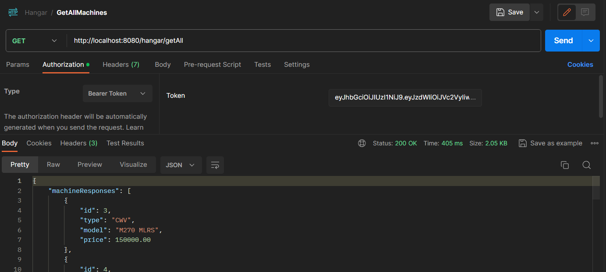

Finally! We got acces to application!

Note that you'll get an empty array in response because you hasn't added any machines to Hangar. To do so, send next request to hangar/post endpoint. Body text you`ll find in data/hangarMachines.txt file, and dont forget token!

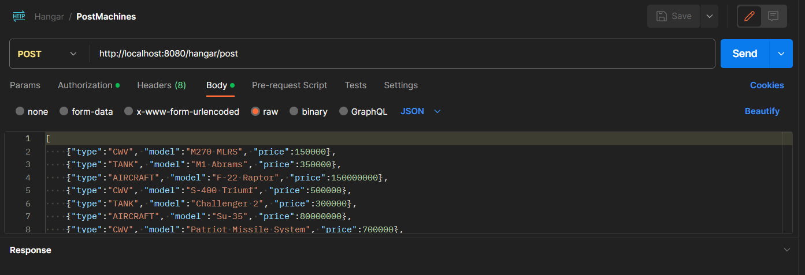


Now let's make an Order. We can do whis through orders/post andpoint:

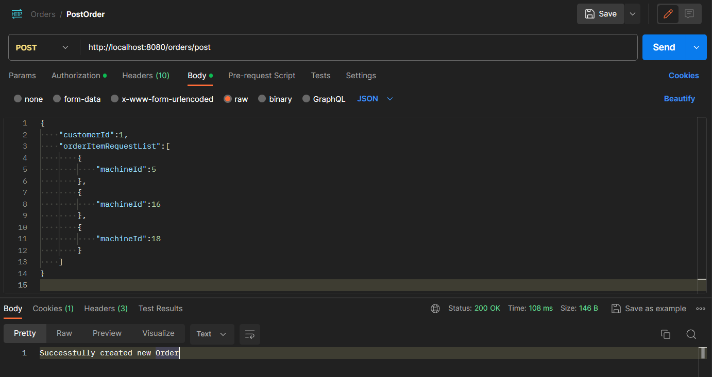

Let's check our new order:

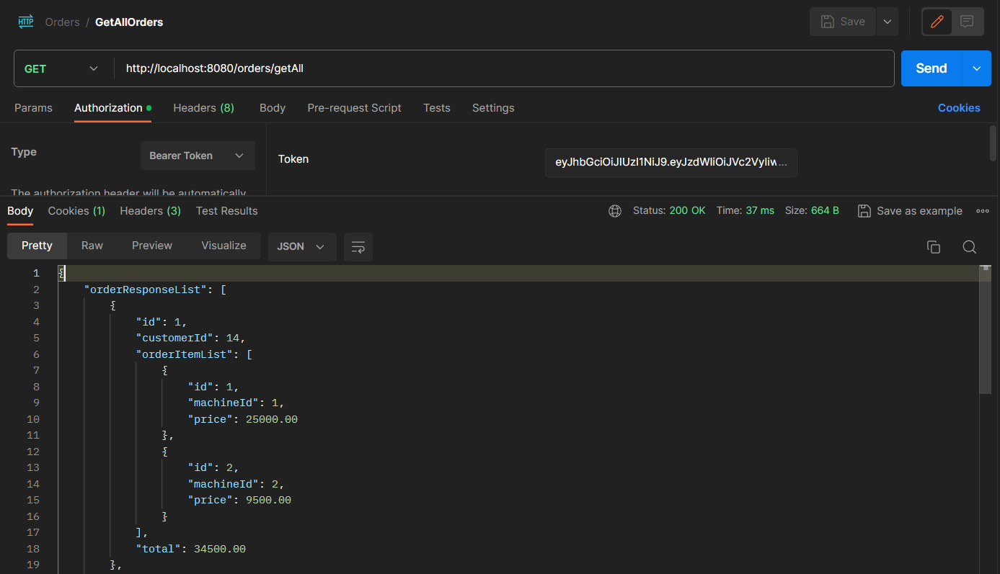

Note that you should see different results because i have already been testing application and created some orders.

Now let's switch to implementation details.


## Technologies used

### Spring Boot

Spring Boot excels in the development of web services and microservices architecture. Its design is particularly well-suited for building scalable and modular applications, making it a popular choice for creating robust and efficient backend services. With built-in support for microservices patterns and easy integration with Spring Cloud, Spring Boot simplifies the development and deployment of distributed systems.

Links:
 - [Official documentation](https://docs.spring.io/spring-boot/docs/current/reference/htmlsingle/)
 - [Great video for beginners](https://www.youtube.com/watch?v=Nv2DERaMx-4&list=LL&index=27&t=17004s)

### Lombok

Lombok is a Java library that reduces boilerplate code by offering annotations to automatically generate common code structures, like getters and setters, during compilation. It simplifies code and improves readability by eliminating the need for manual coding of repetitive tasks, fostering cleaner and more concise Java code.

For example, class MachineRequest from this project, that was written using Lombok:

```java
@Data
@NoArgsConstructor
@AllArgsConstructor
@Builder
public class MachineRequest {
    private MachineType type;
    private String model;
    private BigDecimal price;
}
```

And here's how we would write this class without Lombok

```java
public class MachineRequest {
    private MachineType type;
    private String model;
    private BigDecimal price;
    
    public MachineRequest() {
        
    }

    public MachineRequest(MachineType type, String model, BigDecimal price) {
        this.type = type;
        this.model = model;
        this.price = price;
    }

    public MachineType getType() {
        return type;
    }

    public void setType(MachineType type) {
        this.type = type;
    }

    public String getModel() {
        return model;
    }

    public void setModel(String model) {
        this.model = model;
    }

    public BigDecimal getPrice() {
        return price;
    }

    public void setPrice(BigDecimal price) {
        this.price = price;
    }

    @Override
    public boolean equals(Object o) {
        if (this == o) return true;
        if (!(o instanceof MachineRequest that)) return false;
        return type == that.type && Objects.equals(model, that.model) && Objects.equals(price, that.price);
    }

    @Override
    public int hashCode() {
        return Objects.hash(type, model, price);
    }

    @Override
    public String toString() {
        return "MachineRequest{" +
                "type=" + type +
                ", model='" + model + '\'' +
                ", price=" + price +
                '}';
    }
}
```

The result is clearly visible.

Links:
- [Official documentation](https://projectlombok.org/features/)
- [Introduction to Project Lombok](https://www.baeldung.com/intro-to-project-lombok)

### Spring Data JPA

Spring Data JPA simplifies database access in Spring applications by providing a repository-based abstraction over JPA. It streamlines data operations, supports query methods, and enhances code efficiency when interacting with relational databases.

Usages in project:

- Entity classes
```java
@Data
@NoArgsConstructor
@AllArgsConstructor
@Builder

@Entity
@Table(name = "machine")
public class Machine {

    @Id
    @GeneratedValue(strategy = GenerationType.IDENTITY)
    private Long id;

    @Enumerated(EnumType.STRING)
    private MachineType type;

    private String model;
    private BigDecimal price;
}

```

- JpaRepositories
```java
@Repository
public interface MachineRepository extends JpaRepository<Machine, Long> {

}
```

Fun fact about Repository that we don't need to implement methods to access data. Hibernate generates code automatically. /// NEED MOREINFO

Links:
- [Official documentation](https://spring.io/projects/spring-data-jpa/)
- [Introduction to Spring Data JPA](https://www.baeldung.com/the-persistence-layer-with-spring-data-jpa)

### Eureka

Eureka is a service discovery tool for microservices. It allows services to register and discover each other dynamically, enhancing communication in distributed systems by providing a central registry server.

- Eureka server
```java
@EnableEurekaServer
@SpringBootApplication
public class EurekaServerApplication {

	public static void main(String[] args) {
		SpringApplication.run(EurekaServerApplication.class, args);
	}

}
```

- Eureka client
```java
<dependency>
   <groupId>org.springframework.cloud</groupId>
   <artifactId>spring-cloud-starter-netflix-eureka-client</artifactId>
</dependency>
```

### Spring Cloud Gateway

Spring Cloud Gateway is a robust API gateway built on Spring WebFlux. It simplifies routing, filtering, and load balancing for microservices, offering flexibility and easy configuration in managing API traffic.

- Gateway configuration
```java
 @Bean
 public RouteLocator customRouteLocator(RouteLocatorBuilder builder) {
     return builder.routes()
             .route("security-service-route", r -> r
                     .path("/security/**")
                     .filters(f -> f
                             .rewritePath("/security/(?<segment>.*)", "/api/security/${segment}"))
                     .uri("lb://security-service")
             )
             .route("hangar-service-route", r -> r
                     .path("/hangar/**")
                     .filters(f -> f
                             .filter(authenticationFilter)
                             .rewritePath("/hangar/(?<segment>.*)", "/api/hangar/${segment}"))
                     .uri("lb://hangar-service"))

             .route("orders-service-route", r -> r
                     .path("/orders/**")
                     .filters(f -> f
                             .filter(authenticationFilter)
                             .rewritePath("/orders/(?<segment>.*)", "/api/orders/${segment}"))
                     .uri("lb://orders-service"))
             .build();
 }
```


### Spring Security with JWT authorization

Spring Security with JWT authorization enables secure authentication and authorization in Java applications. It uses JSON Web Tokens for stateless authentication, issuing tokens upon login for subsequent authorization. This approach enhances security and scalability, particularly in distributed and microservices architectures.

- Class that creates and validates JWT tokens
```java
public class JwtUtils {

    public static final String SECRET = "5367566B59703373367639792F423F4528482B4D6251655468576D5A71347437";


    public static void validateToken(final String token) {
        Jwts.parserBuilder()
                .setSigningKey(getSignKey())
                .build()
                .parseClaimsJws(token);
    }


    public static String generateToken(String userName) {
        Map<String, Object> claims = new HashMap<>();
        return createToken(claims, userName);
    }

    private static String createToken(Map<String, Object> claims, String userName) {
        return Jwts
                .builder()
                .setClaims(claims)
                .setSubject(userName)
                .setIssuedAt(new Date(System.currentTimeMillis()))
                .setExpiration(new Date(System.currentTimeMillis() + 1000 * 60 * 30))
                .signWith(getSignKey(), SignatureAlgorithm.HS256).compact();
    }

    private static Key getSignKey() {
        byte[] keyBytes = Decoders.BASE64.decode(SECRET);
        return Keys.hmacShaKeyFor(keyBytes);
    }
}
```

### Circuit Breaker

/// ADD EXAMPLES HERE

///////////////////////// OLD

## Why i created this project

I developed this project to explore and implement new technologies within Spring. If you're also learning and interested in the technology used in this project, you can use it as a base and I'll help you understand how it all works.

### Technologies used in this project

- Spring Boot
- Spring Web
- Spring Cloud
- Spring Data JDBC (DAO classes)
- PostgreSQL database
- Lombok
- Eureka

> Note that these are technologies that are already implemented, but i'm also going to add a few more that i'm working on right now

### Technologies that I am going to implement

- API Gateway
- Security
- Circuit Breaker
- ...


# How to Install the project

1. You need a [database server](https://phoenixnap.com/kb/what-is-a-database-server) installed and running. In my case i used **Postgres**.
2. You need a [Maven](https://maven.apache.org/download.cgi) installed.
3. Clone this GitHub repository to your local machine.
4. Open this project and wait for Maven to download all needed dependencies.

Congratulations, you have successfully installed project and ready to run it!


## Project structure

Inside the project you will find three separate programs - one **Eureka server** and two **services**, namely **Hangar** and **Orders**.

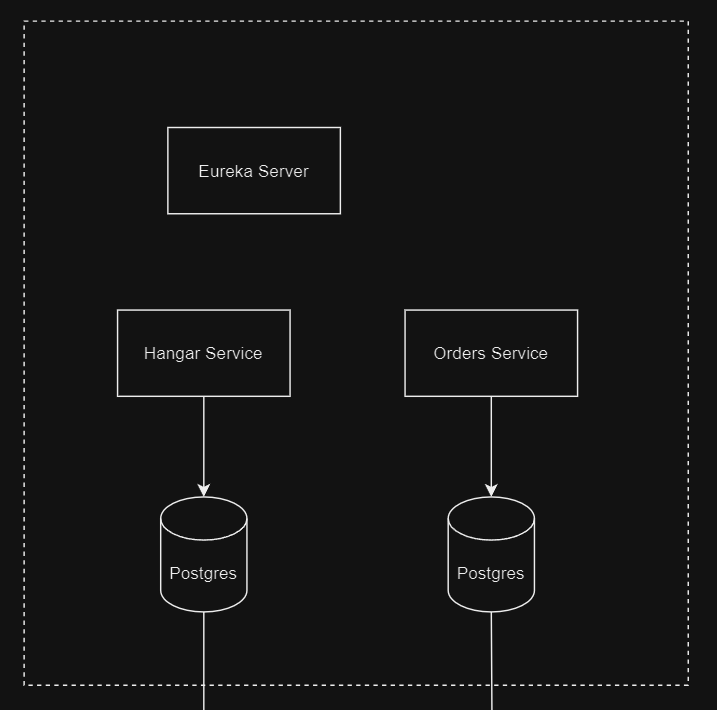


- **Hangar Service** - REST application that stores all machines, Eureka client.
- **Orders Service** - REST application that stores all orders, Eureka client.
- **Eureka server** - we need it for [Service Discovery](https://www.baeldung.com/spring-cloud-netflix-eureka). Also, [this](https://www.youtube.com/watch?v=e09P-CkCvvs&list=PLqq-6Pq4lTTZSKAFG6aCDVDP86Qx4lNas&index=17) is a good video about this topic.


## Database structure

As you can see in the image above, i used [Database per Service](https://microservices.io/patterns/data/database-per-service.html) pattern.

Now, let's look closer at our databases:

### Hangar database schema

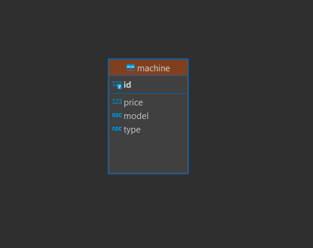

As we can see, this database has only one table that stores all the Machines. As simple as it can be.

### Orders database schema


Orders schema is a little more complicated. Here we have [unidirectional relationship](https://www.baeldung.com/spring-jpa-unidirectional-one-to-many-and-cascading-delete) between **"Orders"** and **"OrderItem"** tables. The third table **"orders_order_items"** is created automatically by Hibernate.

**Orders** table stores orders and can contain one or several **OrderItem** values. **OrderItem** contains machineId and the price of this **Machine**. Therefore it's the relationship [One to Many](https://www.baeldung.com/hibernate-one-to-many).


Now we should have enough information to run project.


# How to Run the project

1. Configure the database server:
   - Make sure that server is running
   - If you're not using Postgres, change **postgresql** to needed value in **"spring.datasource.url"** in **"application.properties"**
   - Check your server port, if it's not **5432**, change value to needed one in **"spring.datasource.url"**
   - Change **"spring.datasource.username"** and **"spring.datasource.password"** to needed values
   - Create database **hangar**
   - Create database **orders**
     
3. Run **EurekaServer** application and wait for it to run completely.
4. Run **Hangar** and **Orders** applications.


If you didn't get eny exceptions, congratulations, your project sturted up successfully!

Now we're ready to send requests, or in other words communicate with our application.


# Sending Requests

Let's now send simple get request to application:


As we can see, request went through and application returned an empty list (because we haven't added some data yet).

> Note that application is working on **localhost** with port **8081**.

### How does it work?

To understand how there requests work, we should take a look on implementation of this request:

```java
@RestController
@RequestMapping("/hangar")
public class HangarController {

    @Autowired
    private HangarService hangarService;


    @GetMapping("/getAll")
    @ResponseStatus(HttpStatus.OK)
    public List<MachineResponse> getAll() {
        return hangarService.getAll();
    }

   ...

}
```

What do we see here?

1. It's the **"Hangar"** application controller that handles **HangarApplication** [API](https://www.mulesoft.com/resources/api/what-is-an-api).
2. Annotation **@RestController** is used to indicate that a class is a controller and that its methods should be treated as request handlers for RESTful web services.
3. **@RequestMapping("/hangar")** indecates **path**:

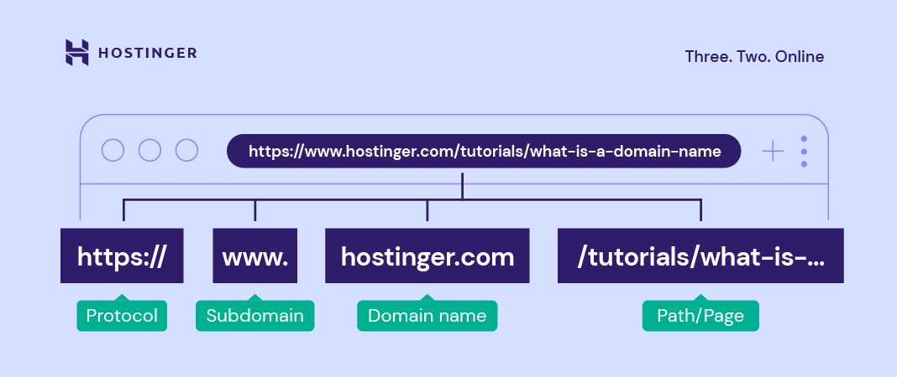

4. **HangarService** - application logic. It is separated because we're using layered acrhitecture.
5. **@GetMapping("/getAll")** - creates page **/getAll** with method **GET** inside the controller.
6. **@ResponceStatus** - you dont actually need it right now, but if you want you can read [here](https://www.baeldung.com/spring-response-status) about it.


That is all! We have just described the code above and how it works!


## Getting deeper

Let's switch to [Postman](https://www.postman.com/downloads/). **Postman** is the application that we can use to communicate with our API in a very convenient and fast way.

### Communicating with Hangar application API


**Add new Machine (POST method)**

Code implementation:

```java
    @PostMapping("/post")
    @ResponseStatus(HttpStatus.CREATED)
    public void post(@RequestBody MachineRequest machineRequest) {
        hangarService.post(machineRequest);
    }
```


> Note that we also need to provide **body** for **MachineRequest** class.


Postman request:

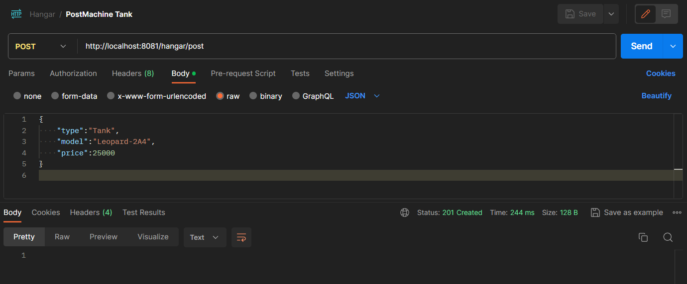


**Get all Machines (GET method)**

Code implementation:

```java
    @GetMapping("/getAll")
    @ResponseStatus(HttpStatus.OK)
    public List<MachineResponse> getAll() {
        return hangarService.getAll();
    }
```


Postman request:

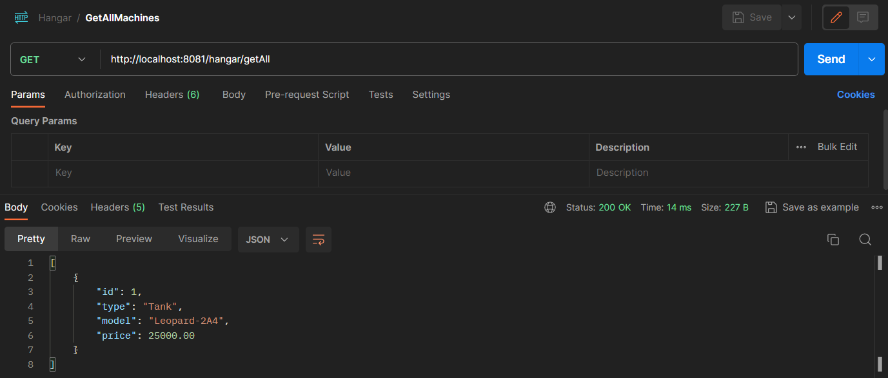


**Get Machine by Id (GET method)**

Code implementation:

```java
    @GetMapping("/get")
    @ResponseStatus(HttpStatus.FOUND)
    public MachineResponse get(@RequestParam Long machineId) {
        return hangarService.get(machineId);
    }
```

> Note that we also need to provide **machineId** parameter.


Postman request:

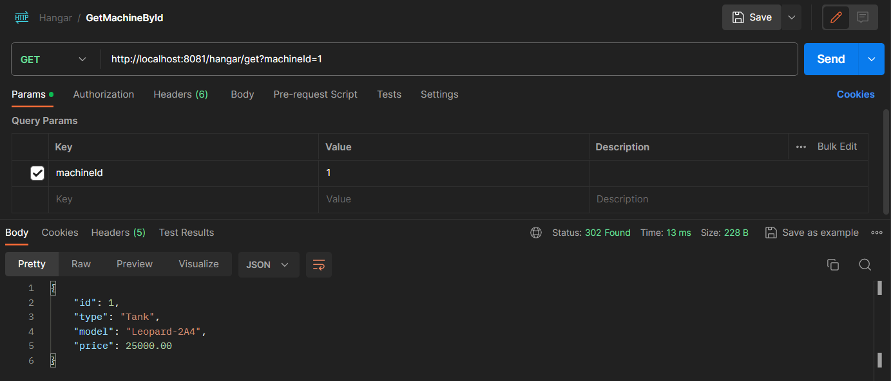


**Delete Machine (DELETE method)**

Code implementation:

```java
    @DeleteMapping("/delete")
    @ResponseStatus(HttpStatus.ACCEPTED)
    public void delete(@RequestParam Long machineId) {
        hangarService.deleteById(machineId);
    }
```


Postman request:

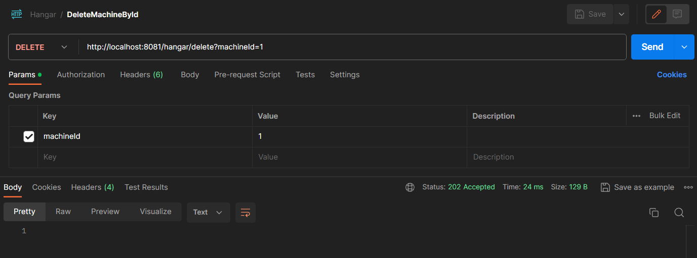


### Communicating with Orders application API


**Add new Order (POST method)**

Code implementation:

```java
    @PostMapping("/post")
    @ResponseStatus(HttpStatus.CREATED)
    public void post(@RequestBody OrderRequest orderRequest) {
        ordersService.post(orderRequest);
    }
```


> Note that we also need to provide **body** for **OrderRequest** class.


Postman request:

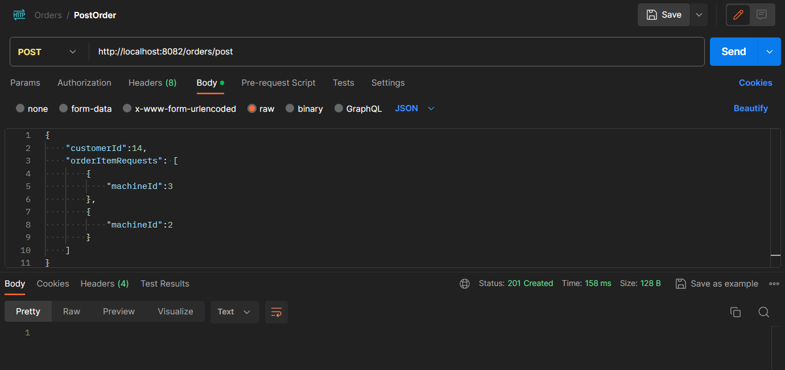


**Get all Orders (GET method)**

Code implementation:

```java
    @GetMapping("/getAll")
    @ResponseStatus(HttpStatus.OK)
    public List<OrderResponse> getAll() {
        return ordersService.getAll();
    }
```


Postman request:

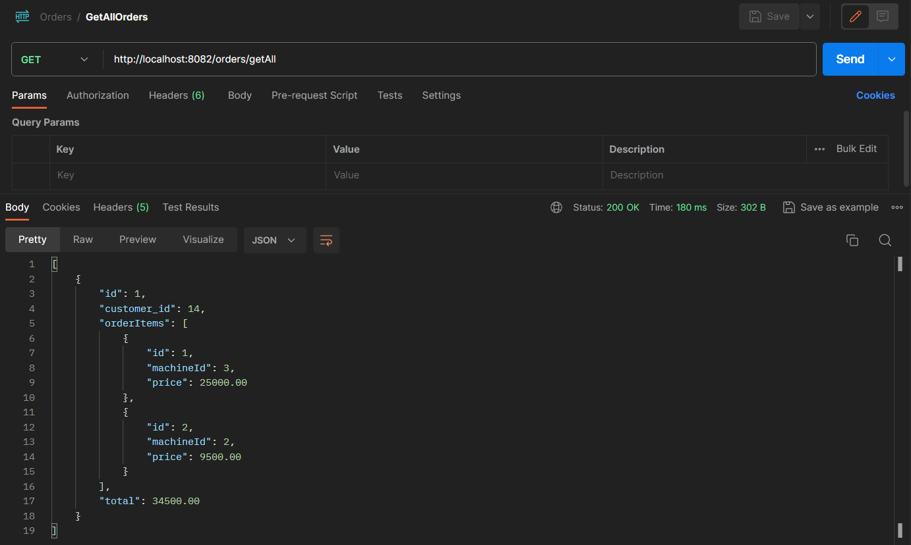


**Get Order by Id (GET method)**

Code implementation:

```java
    @GetMapping("/get")
    @ResponseStatus(HttpStatus.FOUND)
    public OrderResponse get(@RequestParam Long orderId) {
        return ordersService.get(orderId);
    }
```

> Note that we also need to provide **orderId** parameter.


Postman request:

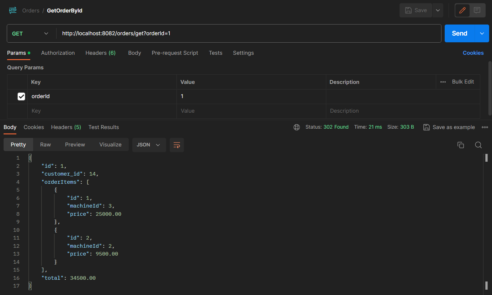


**Delete Order (DELETE method)**

Code implementation:

```java
    @DeleteMapping("/delete")
    @ResponseStatus(HttpStatus.ACCEPTED)
    public void delete(@RequestParam Long orderId) {
        ordersService.delete(orderId);
    }
```


Postman request:

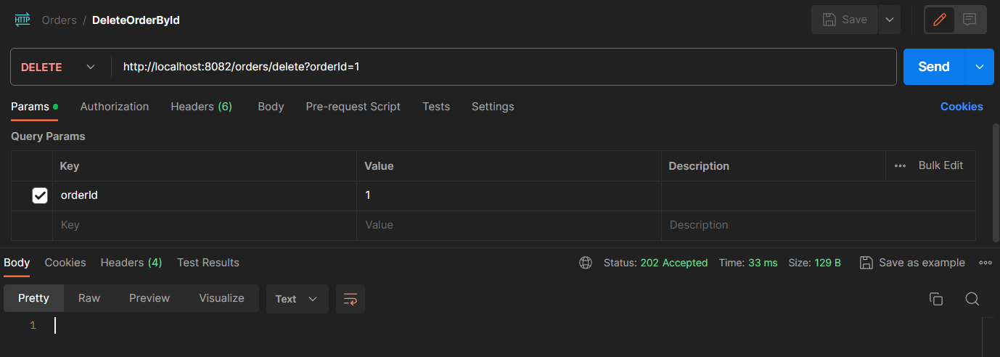


## Microservices communication

I have only one used call between microservices at the moment:

```java
    @Override
    public void post(OrderRequest orderRequest) {
        ...

        orderItems.forEach(orderItem -> orderItem.setPrice(
                restTemplate.getForObject("http://hangar/hangar/get?machineId=" + orderItem.getMachineId(), MachineResponse.class)
                        .getPrice()
        ));

        ...
    }
```

As we can see, I implemented micorservices communication using **RestTemplate**. I know this is deprecated and we should be using **WebClient**, but i don't know reactive programming at the moment.

Also, when working with **RestTemplate** dont forget to initialize it's **Bean** in **Configuration** class:

```java
@Configuration
public class OrdersConfiguration {

    @Bean
    @LoadBalanced
    public RestTemplate restTemplate() {
        return new RestTemplate();
    }
}
```


## Conclusion

I hope you found something new and useful here. I know i missed a lot of details, but if i explained everything here, this README would be much longer :)


## Sources

 - Old but gold [theoretical material](https://www.youtube.com/playlist?list=PLqq-6Pq4lTTZSKAFG6aCDVDP86Qx4lNas)
 - [Practical material](https://www.youtube.com/playlist?list=PLSVW22jAG8pBnhAdq9S8BpLnZ0_jVBj0c)
